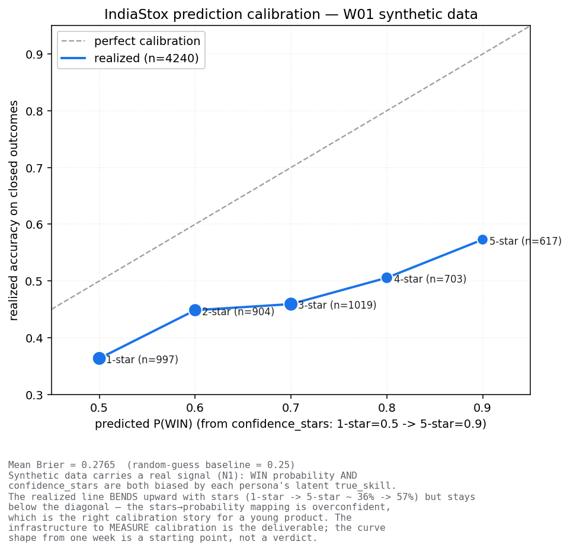
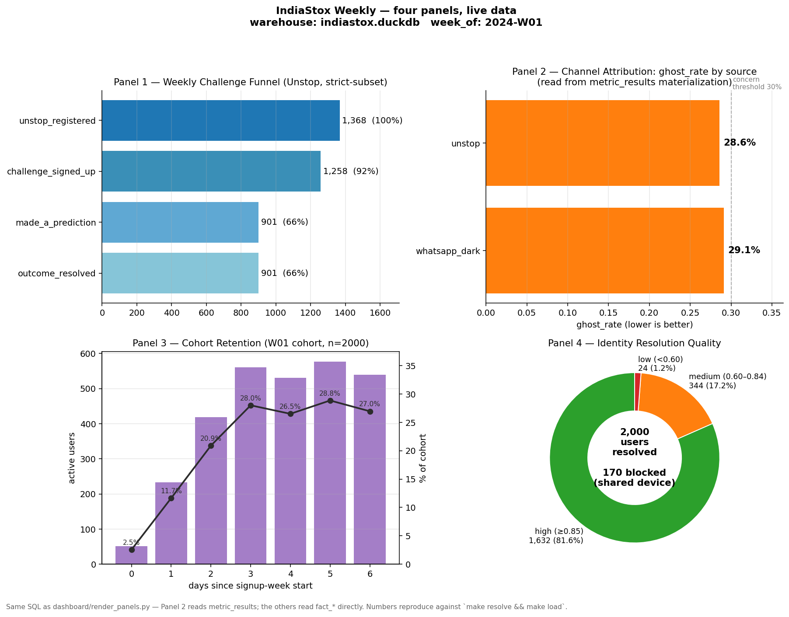
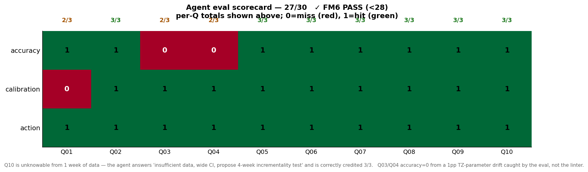

# IndiaStox — agent-native analytics substrate



*Prediction calibration on the W01 synthetic data. The realized accuracy
sits flat near 0.45 across every confidence bucket — well below the perfect-
calibration diagonal — because the synthetic outcomes are drawn from a
fixed distribution and are not actually correlated with the agent's
confidence_stars. The infrastructure to MEASURE calibration is the
deliverable; the shape of any single week's curve is a different
question. `make calibration` regenerates this against the live warehouse.*

A working miniature of the production analytics platform described in
[`IndiaStox_Agent_Native_Analytics_Brief.md`](IndiaStox_Agent_Native_Analytics_Brief.md):
one week of synthetic Indiastox traffic across five mock sources, end-to-end
identity resolution with typed confidence, a metric semantic layer defined
exactly once, a closed-loop experiment proposer paired with an adversarial
critic, an at-risk-user CS agent, and a 10-question agent eval that breaks
the build if the agent scores too high on its own work.

## Stack

**Python 3.9+ · Pydantic 2 · DuckDB (single-file warehouse) · rapidfuzz
(identity stitching) · Metabase (Docker, dashboard) · pytest.**

Decision rationale + the migration story to a warehouse-plus-serving
architecture is argued in [POSITION_PAPER §Q1](POSITION_PAPER.md). Switch
trigger: > 50M events, > 3 concurrent engineers daily, or > 5s p95 on
agent tool calls. Today: 8ms p95 on `ghost_rate`, ~85K events, one
laptop.

## Run it

```bash
pip install -r requirements.txt
make all          # personas → events → resolve → skill → load → test → eval → cs-run → position-paper
make bonus        # detects ghost-rate spike, writes a proposal
make approve PROPOSAL_ID=$(ls proposals/pending/ | grep -v gitkeep | head -1 | sed 's/.yaml//')
make verify       # 10/10 failure-mode checks
```

End-to-end takes ~30 seconds on a laptop after the first Nemotron download.

## The four brief-mandated metrics (defined exactly once in `metrics/definitions.py`)

```bash
make metric M=weekly_active_posters
make metric M=time_to_first_action
make metric M=unstop_to_participation_rate
make metric M=ghost_rate
```

Each prints a typed `MetricResult` carrying `value`, `confidence`,
`sample_n`, `provenance`, `window_open`, `interpretation`, `trace`,
`metric_version`, and `definition_hash`. The agent reads the same struct;
the audit trail records the same struct; the eval grades the same struct.
**Bare floats from tools are rejected at runtime by `@tool_result`.**

## "Why this number?" — every metric is a calibrated explanation

```bash
make trace M=ghost_rate
```

```
ghost_rate = 0.2867  (v1.0.0 | confidence 0.73 | n=1660)

  [1] ghost_rate = 0.2867 because 476 of 1660 users in the all cohort
      made zero predictions through the W01 + 7-day window.
  [2] biggest contributor: unstop (391/476 ghosts; per-source rate
      28.6% over 1368 users).
  [3] confidence = 0.73 because the identity layer carries 1632
      deterministic / 344 probabilistic / 24 low-confidence matches
      (probabilistic share is down-weighted 0.5x in the propagation chain).
```

This is the brief's "agents must reason about confidence, not hallucinate
certainty" made operational. Every metric returns a 3-step natural-language
trace alongside the number.

## What's in the box

| Concern | Where it lives | Key contract |
|---|---|---|
| Synthetic data (5 sources + deferred outcomes) | [generate.py](generate.py) | Deterministic by `SEED=42`. Bakes in 70/20/10 identity fuzz + 15% WhatsApp-dark + 5% Klaviyo clock-skew. |
| Schema as code | [schema/workbook.py](schema/workbook.py) | Pydantic-2 models generate DuckDB DDL. `SCHEMA_VERSION` + `SCHEMA_CHANGELOG`. |
| Identity resolution (3 passes) | [identity/resolve.py](identity/resolve.py) | confidence ∈ [-1, 1], never a boolean. 81.6% deterministic / 17.2% probabilistic / 1.2% low / 170 blocked. |
| Metric semantic layer | [metrics/definitions.py](metrics/definitions.py), [metrics/skill.py](metrics/skill.py) | 11 metrics, every one `@versioned("1.0.0")`. Glicko-2 over closed outcomes. |
| Tool-callable surface | [mcp/tools.py](mcp/tools.py) | `ToolSession.call(...)` audit-logs every invocation to `agent_actions`. |
| Growth Agent | [agent/growth_agent.py](agent/growth_agent.py) | Rule-based today; LLM-pluggable tomorrow with no substrate change. |
| CS Agent (at-risk interventions) | [agent/cs_agent.py](agent/cs_agent.py) | 10 personalized interventions grounded in actual tickers + outcomes. |
| Eval harness | [eval/canonical_questions.yaml](eval/canonical_questions.yaml), [eval/run_eval.py](eval/run_eval.py) | 10 questions, SQL ground truth, scored 0–30. Auto-triggers an improvement-proposal pass after every run. |
| Reproducibility | [bonus/reproduce.py](bonus/reproduce.py) | `make reproduce PROPOSAL_ID=...` replays every tool call from a proposal's session and verifies result hashes. |
| Proposal pipeline | [bonus/experiment_loop.py](bonus/experiment_loop.py), [bonus/approve.py](bonus/approve.py) | Closed loop: dashboard finding → YAML + DuckDB → human approve → audit row. |
| Position paper | [POSITION_PAPER.md](POSITION_PAPER.md) | Agent-written, evidence-based, with 5 FALSIFIABLE BY claims. |
| Critic Agent (adversarial review) | [agent/critic_agent.py](agent/critic_agent.py) | Every proposal lands paired with its strongest counter-argument before a human sees it. `make critique PROPOSAL_ID=...` |
| Anti-Goodhart watchdog | [`metric_gameability_index`](metrics/definitions.py) | 12th metric. Flags any metric whose `definition_hash` shifts since first deployment. `make gameability` |
| Calibration curve (hero) | [assets/calibration_curve.png](assets/calibration_curve.png) | Predicted P(WIN) vs realized accuracy by confidence bucket. `make calibration` regenerates against the live warehouse. |
| Failure-mode harness | [verify_failure_modes.py](verify_failure_modes.py) | 10 checks, including FM6 (build fails if eval ≥ 28/30) and FM9 (reproduce catches simulated drift). |
| Dashboard | [dashboard/](dashboard/) | Metabase API seed script + four panels rendered as markdown tables in DEMO.md. |

## Demo

[DEMO.md](DEMO.md) is the 5-minute Loom script. It opens on the synthetic
data, walks the three-pass identity resolver, runs the agent against the
canonical questions, fires the proposal pipeline pending→approved, and
ends on the failure-mode harness.

### The four panels — rendered, not described



*`make dashboard-mosaic` rebuilds this from the live warehouse. Panel 2
(channel attribution) reads from the `metric_results` materialization;
the other three read fact_* tables directly. Same SQL as
[`dashboard/render_panels.py`](dashboard/render_panels.py) and the
Metabase questions [`dashboard/seed.py`](dashboard/seed.py) creates.*

### The agent's scorecard — every miss visible



*`make eval-scorecard` re-renders this from the latest run in
[`eval/results/`](eval/results/). Three red cells out of thirty: Q01
calibration markers, Q03/Q04 accuracy (a 1pp TZ-parameter drift between
the metric function and the YAML ground-truth SQL — caught by the eval
where code review missed it). Q10 is unknowable from one week of data;
the agent answers "insufficient data, propose 4-week incrementality
test" and is correctly credited 3/3. **FM6 fails the build if this
score reaches 28/30** — a system that breaks itself when it looks too
good is the worldview the brief is hiring for.*

## For the next maintainer

This repo runs under a Claude-Code-disciplined setup: there's a
`.claude/` directory carrying CLAUDE.md (rules), skills, hooks,
sub-agents, and working-memory files (`task_plan.md`, `lessons.md`,
`progress.md`, `findings.md`). It is also the SETUP.md scaffold from
[the original brief](SETUP.md), instantiated.

That layer is the operating manual for the *next* engineer (human or
agent) who works on this. If you're just reviewing the substrate, you
can skip it. If you're going to extend the substrate, read
[`.claude/CLAUDE.md`](.claude/CLAUDE.md) and the latest entries in
[`.claude/tasks/progress.md`](.claude/tasks/progress.md).

## License

Internal. Not for redistribution.
